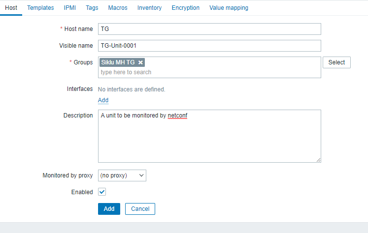
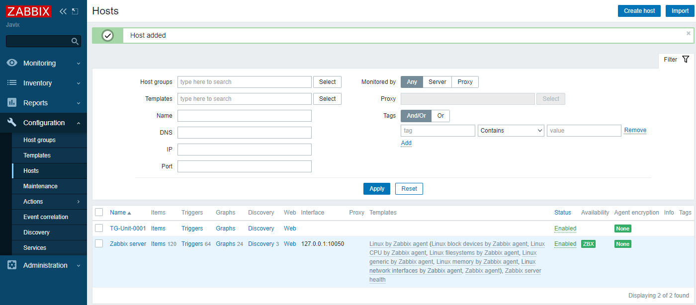
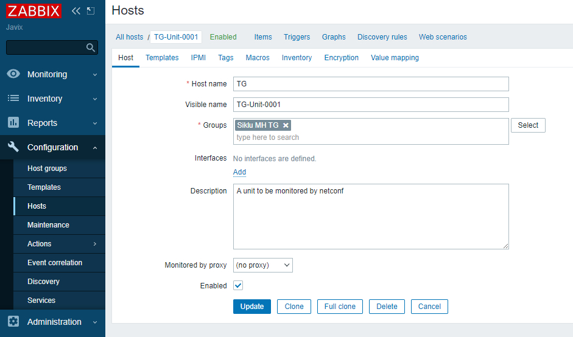
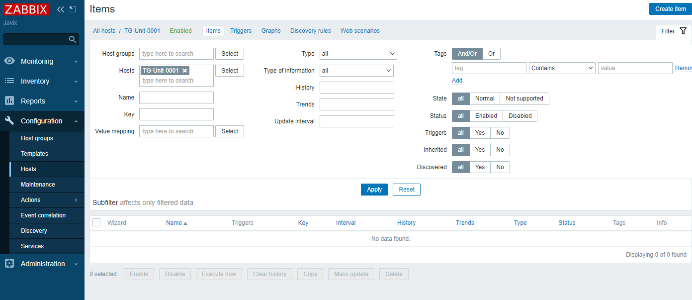
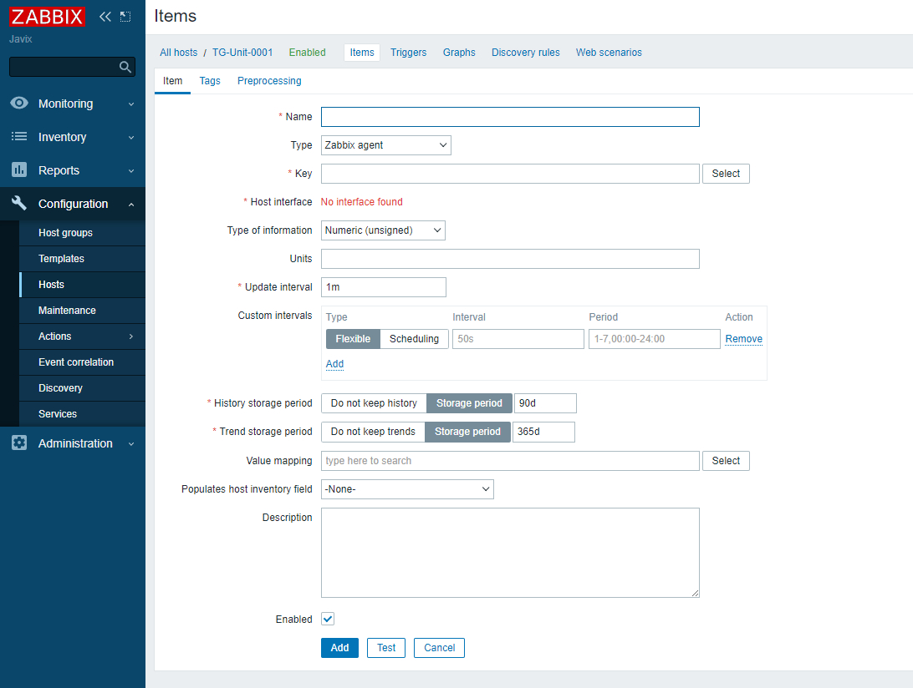
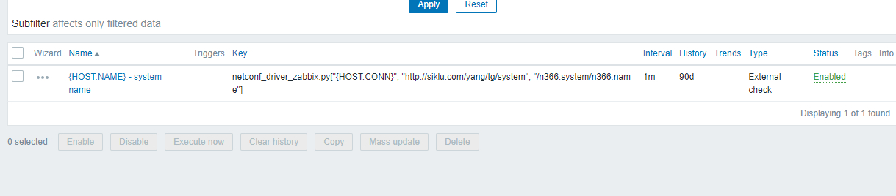

# zabbix_netconf_script
A python script that will enable Zabbix to get netconf data from a unit.
This instructions are for a Linux installation of Zabbix.

**The script needs to target unique values!!**

The instructions were tested on Ubuntu 20.04

# install instructions  
1. Make sure you have Python 3.8+
   - On a terminal or in cli run `python3` and check the version on the output. `Python 3.8.10 (default, Mar 15 2022, 12:22:08)`
2. Install pip `apt install python3-pip`
3. Install ncclient on the linux Zabbix server. `pip install ncclient`. This also install paramiko and lxml. With this modules we will be able to open a connection to the netconf unit and poll the data.
4. Install zabbix according to the instructions from: [Zabbix](https://www.zabbix.com/download)
5. We need to enable an external check in Zabbix.  
   - To enable it, we need to modify the `zabbix_server.conf` file
   - look for the line with `#ExternalScripts=/usr/lib/zabbix/externalscripts` and uncomment it `ExternalScripts=/usr/lib/zabbix/externalscripts` and save it
6. We can save our custom scripts in `/usr/lib/zabbix/externalscripts`
7. Use wget to save the file on the externalscripts folder  
  `wget -P /usr/lib/zabbix/externalscripts/ https://raw.githubusercontent.com/Javopan/zabbix_netconf_script/main/netconf_driver_zabbix.py`
8. Change the owner of the file to zabbix and group zabbix:  
  `chown zabbix:zabbix /usr/lib/zabbix/externalscripts/netconf_driver_zabbix.py`
9. Change the permissions to execute the file:  
  `chmod 700 /usr/lib/zabbix/externalscripts/netconf_driver_zabbix.py`
10. Restart the Zabbix services:  
  `service zabbiz-agent restart`  
  `service zabbiz-server restart`  
  We are now ready to add a host and add an external check.
11. Log in into your Zabbix instance and add a new host from
12. Configuration -> Hosts and on the upper right of the window click on Create Host
13. Fill in the data and add it to a desired group and add a description  
  In this case  
  Host name `TG`  
  Visible name `TG-Unit-0001`  
  Groups `Siklu MH TG`  
  Add an interface with the IP of the radio to monitor. The type is not important. (For this test it was agent)  
  Description `A unit to be monitored by netconf`  
  Enabled `checked`  
    
14. Click Add
15. The new Host shall be in the hosts website  
    
16. Click on the new host that you want to configure in this case `TG-Unit-0001`
    
17. In the upper gray ribbon click Items  
  
18. On the upper right corner click `Create item`
  
19. Fill in the relevan data. In this case we are using a Zabbix macro `{HOST.NAME} - system name` to give it a meaningful name of what we will poll.
20. Select from the Type list `External check`
21. on they Key field we need to add the script we want to run with the parameters to do the poll.  
  - In this particular case we need want to try to poll the system name of the unit.  
  - netconf_driver_zabbix.py is the name of the script downloaded from here and that will be executed
  - all the parameters that the script will take needs to be between [] and enclsed in ""
  - argument 1: IP Address of the unit we want to monitor. We can use a macro to get it from the host  
    in this case {HOST.CONN}
  - argument 2: The namespace of the module we want to poll. For this case system. the namespace is : `http://siklu.com/yang/tg/system`  
  - argument 3: The path of the object that we want to get. in this case name `/n366:system/n366:name`.  
    The n366 is how the scripts adds the namespace to the object path so always add n366: the deeper you go on the path to reach the object  
    for example here we are polling system/name and the script will give us the value of name
  - `netconf_driver_zabbix.py["{HOST.CONN}", "http://siklu.com/yang/tg/system", "/n366:system/n366:name"]`
  - Type of information leave it as text or the type of value you will get
  - update interval set it for the time you need. In this example it is set to 1 minute `1m`
  - Fill in the rest according to your needs and add the Item  
22. Check that the new item is on the Host Items list with status enabled
    
23. If everything worked you can now go to Monitoring Latest data and check that your external check is being pulled
    
