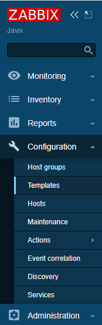
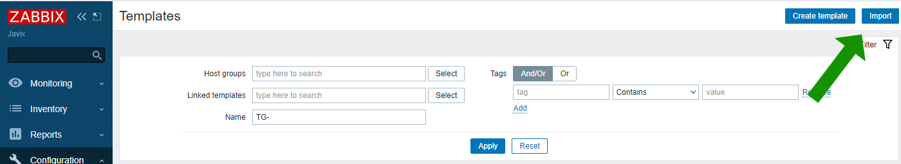
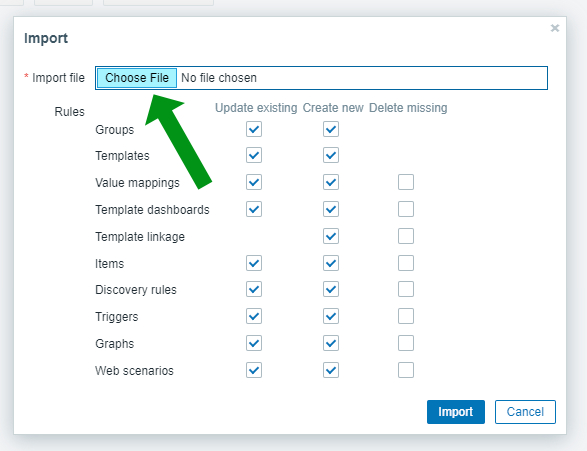
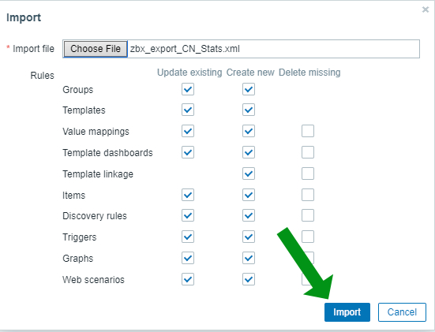
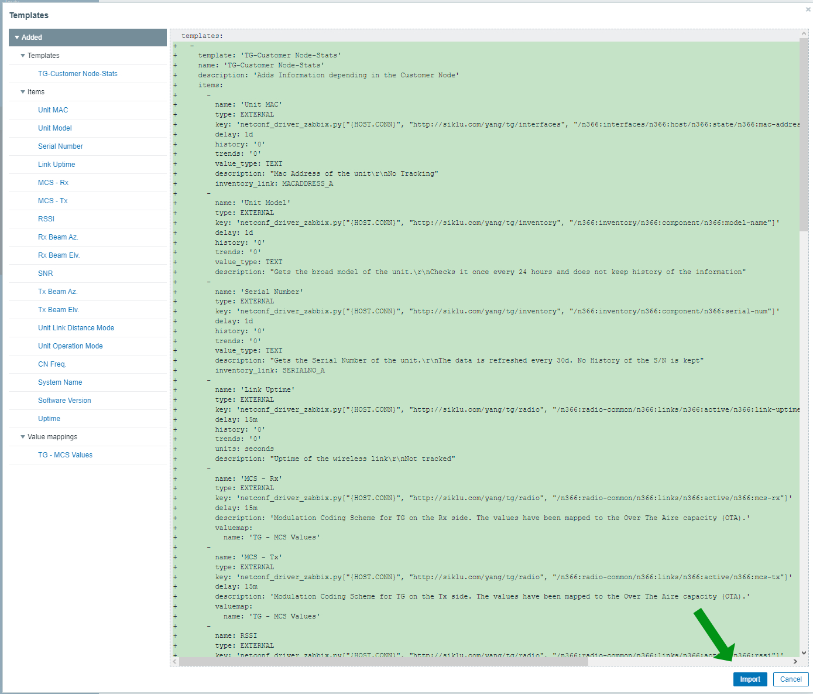
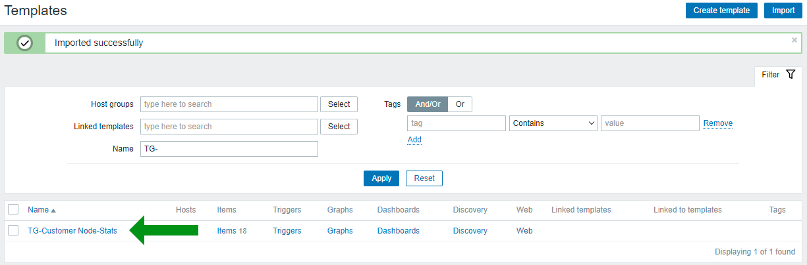

# Templates for Zabbix 5.4
## Instructions on how to upload  
1. To upload a template go to Configuration -> Templates  
     
3. Click Import on the upper right part of the screen  
     
4. Click Choose File  
     
6. Select the desired Template you want to import
    - In the templates there are 3 files for convenience, **you just need 1** we provided all the possible extensions to select the one you work with (XML | JSON | YAMAL)
8. Click Import  
     
9. A review of the file will appear with the data it will create. Click Import  
     
10. Your new template should appear in your Templates. (You might need to filter for it in case you don't have any)
     
